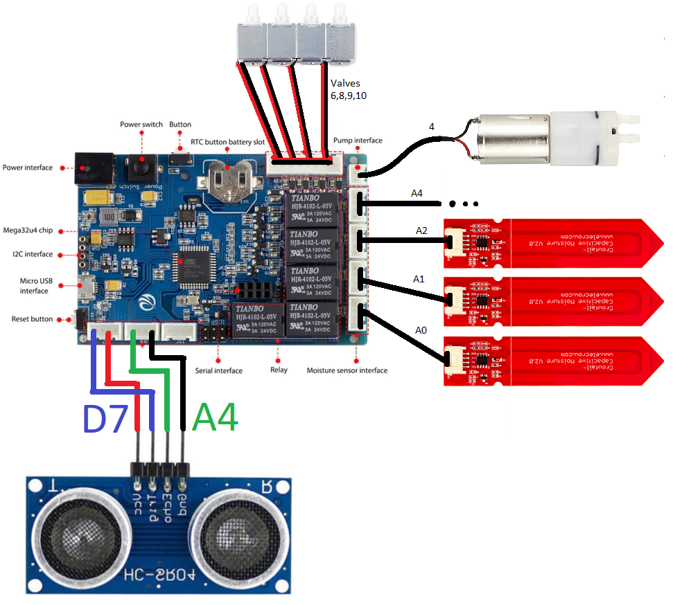

# Herbio - Ardiono design sheet


Scheme of wiring



# Code
Code is writen with in PlatformIO envirnoment for future possible support.

Code Structure is separated into 2 files:    
>### [main.cpp](src/main.c++)
> contains main setup() and loop().    
> Main logic is handeled:    
> * Serial communication (requests/commands),    
> * timers.   
> 
> Object initialization is done in global scope using specified constructor. Most constructors follow the > rule: 
> ```c++
> (uint8_t id, uint8_t pin, /* pin2,*/ char* name,  ..other)
> //In case of HC-SR04 *pin2* is also required.
> ```
>Serial com. Commands:   
>*implemented:*   
>`command get <id>` - return Json of entity by ID    
>`command get -all` - list of all entities just {ID,NAME} for full report call `command >get <i>` one by one        
>*to be implemented:*   
>`command set time <epoch or whatever idk yet>` updates internal RTC module to specific > time    
>if Serial input starts with `{` following this message is parsed as Json.
>USE `{` to update entity determined by ID. updated are just specific variables such as: >`name`, `treshholds-limits`, `active state`. 


>### [classes.h](src/classes.h)    
>contains definitions and implementation of actors in the project. Two abstract classes ***Entity*** and ***Measurable*** specify certain object what funcions are implemented.    
> ***Entity*** has:   
> ```c++
> class Entity  {
>   byte id;          //id
>   String name;      //human readable name
>   virtual JsonObject  toJson(JsonDocument &doc) = 0;  // appends self-Json representation to &doc 
>   virtual boolean     update(JsonObject &doc) = 0; // update self IF id matches
>   };
> ```
> ***Measurable*** implements just:  *`float`* `measure*(),`


